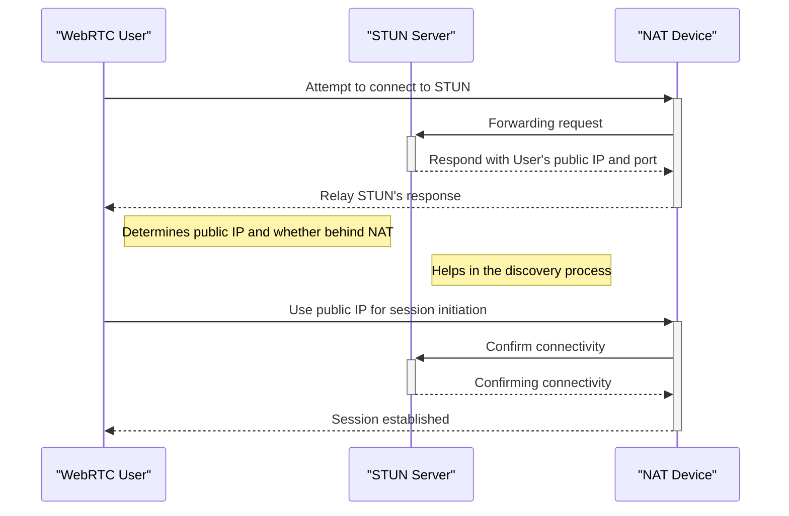

# Firebase + WebRTC Codelab
### Full code solution can be found under the branch: _solution_
This is the GitHub repo for the FirebaseRTC codelab. This will teach you how 
to use Firebase Cloud Firestore for signalling in a WebRTC video chat application.

The solution to this codelab can be seen in the _solution_ branch.

See http://webrtc.org for details.

# WebRTC Stun and Nat Flow  

